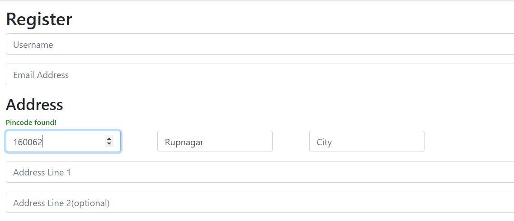
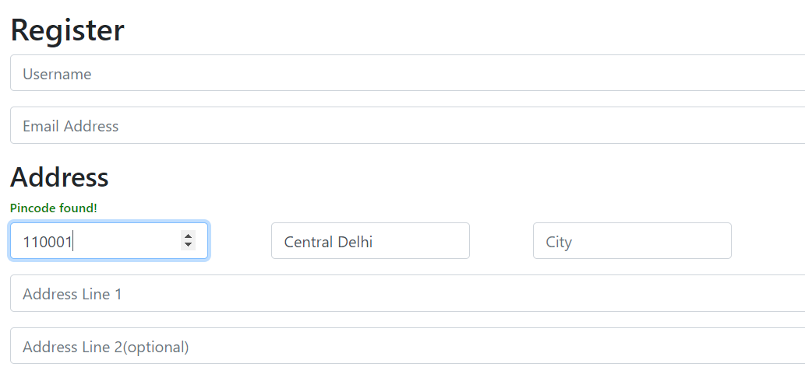
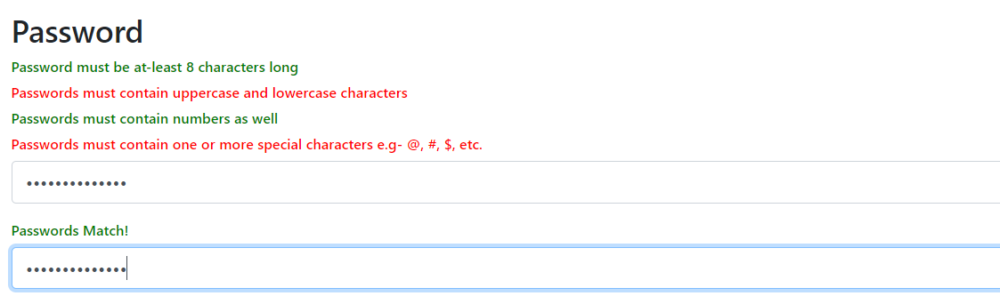
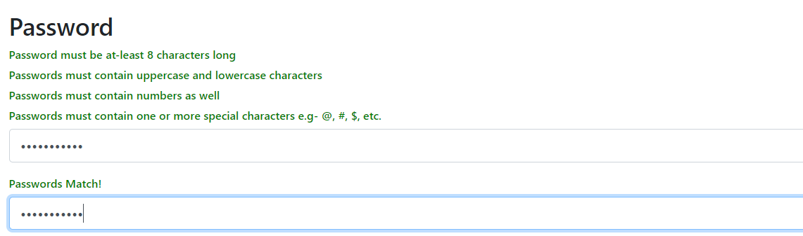

# Registration Form (JS Powered)

### Description
This is a registration form which is powered by javascript, means that it validates the passwords given are checked by the given rules and they go green if requirements are met!  
This form also checks the pin-code you entered and automatically fills the **District** field to the corresponding pincode.  
This has been done by hitting the GET request on this **https://api.postalpincode.in/pincode/${pincode}** url where the pincode is the pincode provided by you.

### screenshots
1. Pincode validation:

   
2. Password Validation:

   
### how to use
Feel free to use in your projects, and give a star!

**You can set the required fields to whatever fields you want**

It won't register the form until all the requirements are fullfilled!

**Give it a try!**